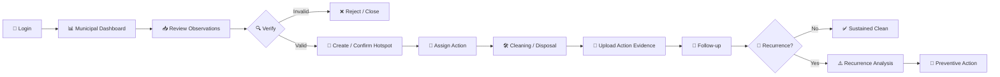

# 🗑️ safAI — Smart Action Framework for Awareness & Improvement

---

<p align="center">
  <strong>Clean spaces need more than cleanup. They need continuous action.</strong>
</p>

<p align="center">
  A student-supported sanitation improvement system that connects waste observation, hotspot tracking, community participation, municipal action, and follow-up.
</p>

<p align="center">
  
  
  
</p>

---

## 🔗📋 Table of Contents

- [Overview](#overview)
- [Problem Statement](#problem-statement)
- [Our Solution](#our-solution)
- [Why safAI?](#why-safai?)
- [Key Features](#key-features)
  - [Student Observation](#student-observation)
  - [Evidence Collection & Validation](#evidence-collection--validation)
  - [Hotspot Intelligence](#hotspot-intelligence)
  - [Waste Segregation & Disposal Awareness](#waste-segregation--disposal-awareness)
  - [Municipal Verification](#municipal-verification)
  - [Community Activities](#community-activities)
  - [Recurrence Tracking](#recurrence-tracking)
  - [Follow-up & Sustained Cleanliness](#follow-up--sustained-cleanliness)
  - [AI-Assisted Insights](#ai-assisted-insights)
- [How safAI Works](#how-safai-works)
- [User Flow](#user-flow)
- [Tech Stack](#tech-stack)
- [Impact & Success Metrics](#impact--success-metrics)
- [Team](#team)

---

## 📋 Overview

- **safAI — Smart Action Framework for Awareness & Improvement** is a student-supported sanitation improvement platform.

- Connects **students, schools/Eco Clubs/NSS units, and municipal sanitation teams** around local waste problems.

- Enables students to **observe and submit waste problems** using live photo/video, location, time, waste category and severity.

- Converts verified locations into persistent **Hotspots** instead of treating every report as a one-time complaint.

- Maintains hotspot history including **municipal actions, community activities, follow-ups and recurrence**.

- Supports **waste segregation and responsible disposal awareness** while keeping hazardous and professional waste handling with authorised personnel.

- Helps municipalities identify **recurring dumping locations** and take preventive action instead of repeatedly responding to the same problem.

- Uses AI for practical assistance such as **waste classification, duplicate detection, image similarity and recurring-pattern identification**.

- Focuses on one key outcome:

> **From reporting waste to keeping locations clean.**

---

## 📌 Problem Statement

| Field | Details |
|---|---|
| **Problem Statement ID** | 26195 |
| **Problem Statement Title** | Student Innovation-Solutions could be in the form of waste segregation, disposal, and improve sanitization system. |
| **Organization** | AICTE |
| **Department** | AICTE, MIC-Student Innovation |
| **Category** | Software |
| **Theme** | Clean & Green Technology |

---

## 💡 Our Solution

- **safAI adds a student-supported observation layer** to the existing municipal sanitation system.

- Students can **capture and submit real-world waste observations** during their normal movement without becoming responsible for sanitation work.

- Multiple observations from the same location are **validated and grouped into a single Hotspot**.

- Every verified Hotspot gets a **persistent history** of waste, municipal actions, community activities, follow-ups and recurrence.

- Municipal teams can **verify, assign, act, and track** sanitation issues from the same system.

- Schools, Eco Clubs and NSS units can connect with verified hotspots for **safe awareness, segregation and community activities**.

- AI assists with **waste classification, duplicate detection, image similarity and recurrence patterns** while official decisions remain with authorities.

- The system continues tracking a location **after cleanup**, helping identify whether it becomes clean or turns into a recurring hotspot.

> **Observe → Validate → Verify → Act → Follow Up → Prevent Recurrence**

---

## 🗑️ What is safAI?

- **safAI (Smart Action Framework for Awareness & Improvement)** is a student-supported sanitation improvement platform.

- It connects **students, schools/Eco Clubs/NSS units, and municipal teams** to identify, verify and track local waste problems.

- Instead of treating waste reports as one-time complaints, safAI creates **persistent Hotspots** that maintain their history, actions and recurrence.

- Students contribute through **safe observation, evidence collection and community awareness**, while municipal teams remain responsible for official verification and sanitation action.

- AI assists with **waste classification, duplicate detection and recurring-pattern analysis**.

> **From reporting waste to keeping locations clean.**

---

## ✨ Key Features

### 👀 Student Observation
- Report significant waste or dumping encountered during normal movement.
- Capture live photos/videos with location and time.

### 📸 Evidence Collection & Validation
- Record waste category, severity and supporting evidence.
- Validate observations and identify incomplete or duplicate submissions.

### 📍 Hotspot Intelligence
- Convert verified waste locations into persistent **Hotspots**.
- Maintain a complete history of observations, actions and status for each location.

### ♻️ Waste Segregation & Disposal Awareness
- Identify categories such as wet, dry/recyclable, sanitary and construction waste.
- Support awareness of appropriate segregation and disposal pathways.

### 🏛️ Municipal Verification
- Enable municipal teams to verify observations and confirm hotspots.
- Track assignments, sanitation actions and before/after evidence.

### 🤝 Community Activities
- Connect schools, Eco Clubs and NSS units with suitable verified hotspots.
- Record safe awareness, segregation and supervised community activities.

### 🔄 Recurrence Tracking
- Link new observations to existing hotspots at the same location.
- Identify locations that repeatedly become dumping points after cleanup.

### ✅ Follow-up & Sustained Cleanliness
- Track hotspots after municipal action instead of closing them permanently after cleanup.
- Measure whether locations remain **clean, recurring or require further intervention**.

### 🤖 AI-Assisted Insights
- Assist with waste classification and image similarity.
- Support duplicate detection and identification of recurring waste patterns.
- Keep official verification and decisions under responsible authorities.

---

## ⚙️ How safAI Works

```text
 OBSERVE
Student notices improper dumping
        ↓
 CAPTURE
Live photo/video + location + time
        ↓
 VALIDATE
Check evidence, category & duplicate observations
        ↓
 HOTSPOT
Create or link the observation to a verified location
        ↓
 VERIFY
Municipal team verifies the reported problem
        ↓
 ACT
Cleaning, collection, transportation or appropriate disposal
        ↓
 COMMUNITY
School / Eco Club / NSS conducts suitable awareness activity
        ↓
 FOLLOW UP
Track the hotspot after municipal action
        ↓
        ┌───────────────────┐
        │                   │
        ▼                   ▼
    SUSTAINED CLEAN    RECURRING
                            ↓
                    Pattern identified
                            ↓
                    Preventive action
```

---

## 🔄 User Flow

### 👨‍🎓 Student Flow


### 🏫 School / Eco Club / NSS Flow

```mermaid
flowchart LR
    A["🔐 Login"] --> B["🏠 Dashboard"]
    B --> C["📍 View Nearby Hotspots"]
    C --> D["🔎 Select Suitable Hotspot"]
    D --> E["📋 Plan Activity"]
    E --> F["🤝 Conduct Safe Activity"]
    F --> G["📸 Submit Activity Evidence"]
    G --> H["🔄 Follow-up"]
    H --> I["📊 View Community Impact"]
```



### 🏛️ Municipal Flow



---

## 🛠️ Tech Stack

| Layer | Technology |
|---|---|
| 🎨 **Frontend** | React / Flutter (Mobile-first PWA) |
| ⚙️ **Backend** | Node.js / FastAPI (REST APIs) |
| 🗄️ **Database** | PostgreSQL + PostGIS — Location & hotspot history |
| ☁️ **Storage** | Cloud Storage — Photos / Videos |
| 🗺️ **Maps & Location** | GPS + Google Maps API (or Open Source) |
| 🔔 **Notifications** | FCM / Web Push |
| 🤖 **AI (Assistive)** | Image classification, duplicate detection, location clustering, recurrence analysis |

---

## 🖥️ Project Preview

<p align="center">
  
  &nbsp;&nbsp;
  
  &nbsp;&nbsp;
  
  &nbsp;&nbsp;
  
</p>

---

## 📈 Impact & Success Metrics

### 🌱 Expected Impact

-  Better identification of **local waste hotspots**
-  Faster visibility of **recurring dumping locations**
-  Improved **waste segregation & disposal awareness**
-  Stronger coordination between **students, communities and municipalities**
-  Increased participation of **schools, Eco Clubs and NSS units**
-  Shift from **one-time cleanup to long-term cleanliness**
-  Cleaner and more sustainable **local communities**

### 📊 Success Metrics

| Metric | What We Measure |
|---|---|
|  Hotspots Identified | Number of genuine waste hotspots detected |
|  Verification Rate | Percentage of observations successfully verified |
|  Response Time | Time taken from verification to municipal action |
|  Hotspots Resolved | Number of hotspots cleaned and addressed |
|  Recurrence Rate | Number of hotspots where waste reappears |
|  Community Activities | Awareness, segregation and supervised activities conducted |
|  Follow-up Evidence | Hotspots with post-action verification |
|  Sustained Cleanliness | Locations that remain clean after intervention |
|  Recurring → Clean | Hotspots converted from recurring problems to sustained cleanliness |

> **The ultimate measure of safAI is not how many reports are submitted — it is how many locations become and remain clean.**

---

## Team

| S.No | Team Member | LinkedIn |
|---|---|---|
| 1 | **Sushant kumar Mishra** | [LinkedIn](https://www.linkedin.com/in/mishragisonline) |
| 2 | **Surbhi Sharma** | [LinkedIn](https://www.linkedin.com/in/surbhi-sharma-tech) |
| 3 | **Riya** | [LinkedIn](https://www.linkedin.com/in/riya-bansal-a1731a37a) |
| 4 | **vipul Sethi** | [LinkedIn](https://www.linkedin.com/in/vipul-sethi-b1508937a) |
| 5 | **Neeraj Kumar** | [LinkedIn]([www.linkedin.com/in/neerajkumarlearner](https://www.linkedin.com/in/neerajkumarlearner/?lipi=urn%3Ali%3Apage%3Ad_flagship3_profile_view_base_contact_details%3B1lAwVieSTJKhc8eyVmmWMQ%3D%3D)) |
| 6 | **Sharanpreet Kaur** | [LinkedIn](https://www.linkedin.com/in/sharanpreet-kaur-1a00a037a) |

---

## 🌱 Conclusion

**safAI is built on a simple idea:**

> **Don't just report waste. Help make the place stay clean.**

By connecting **students, communities, and municipal teams**, safAI turns everyday observations into verified hotspots, coordinated action, follow-up, and long-term cleanliness.

###  Thank You

> **Observe. Act. Follow Up. Keep It Clean.**

**Thank you for exploring safAI! 💚**

---
